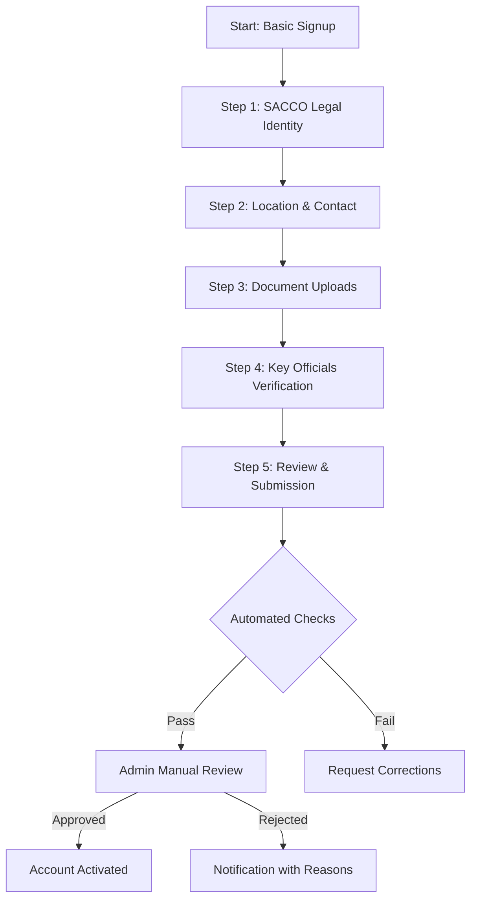
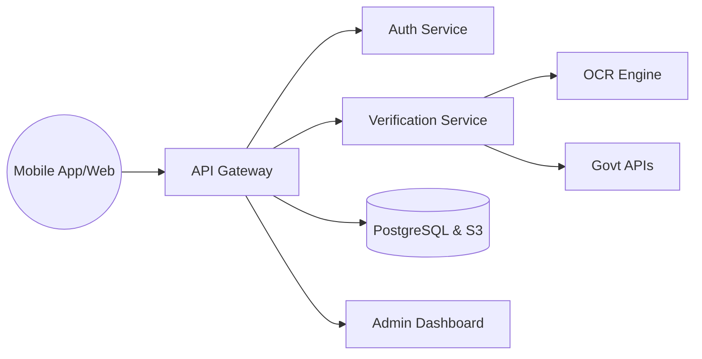

# SACCO Onboarding & Verification System Design

This document outlines the architecture and workflows for a secure, scalable SACCO onboarding system tailored for the East African market.

## 1. Onboarding Flow (Step-by-Step)

## 2. Required Data Fields

### Step 1: SACCO Identity
- **Legal Name:** Registered name as per certificate.
- **Registration Number:** Unique ID from the regulator (e.g., SASRA, UMRA).
- **Date of Registration:** When the SACCO was formed.
- **SACCO Category:** (e.g., Deposit-taking, Non-deposit taking, Community-based).

### Step 2: Contact & Location
- **Physical Address:** HQ location.
- **GPS Coordinates:** To prevent "ghost" SACCOs.
- **Official Phone:** Verified via OTP.
- **Official Email:** For formal correspondence.

## 3. Document Uploads
| Document Type | Purpose | Validation |
| :--- | :--- | :--- |
| **Registration Certificate** | Proof of legal existence | OCR & Registry check |
| **Operational License** | Authority to operate (e.g., SASRA License) | Expiry date validation |
| **TIN/PIN Certificate** | Tax compliance | URA/KRA API check |
| **SACCO Bylaws** | Governance structure | Manual review |
| **Board Resolution** | Authorization to join platform | Manual review |

## 4. Verification of Key Officials
For the Chairman, Secretary, and Treasurer:
1. **National ID/Passport:** Scanned and verified via government APIs (IPRS/NIRA).
2. **Liveness Check:** Selfie comparison with ID photo to prevent spoofing.
3. **Phone Verification:** SMS OTP to their personal numbers.

## 5. Automated Validation Checks
- **Duplicate Detection:** Checks if Reg No, TIN, or Phone already exists.
- **OCR Analysis:** Extracts text from documents to ensure they match form data.
- **Blacklist Screening:** Cross-referencing names against AML/Sanctions lists.
- **Data Consistency:** Ensuring the registration date isn't in the future.

## 6. Manual Admin Review Process
Admins perform a "Sanity Check" via a dashboard:
- **Visual Inspection:** Are the documents legible and not tampered with?
- **Regulator Portal Check:** Manually verifying the status on SASRA/UMRA public portals.
- **Risk Assessment:** Flagging high-risk locations or suspicious board structures.

## 7. Regional Integrations (East Africa)
- **Kenya:** SASRA Portal, IPRS (Identity), KRA (Tax).
- **Uganda:** UMRA, NIRA (Identity), URA (Tax), URSB (Business Registration).
- **Rwanda:** RCA (Rwanda Cooperative Agency).
- **Verification Hubs:** Integration with providers like **SmileID** or **Metamap** for unified KYC across borders.

## 8. Approval/Rejection Logic
- **Pending:** Initial state after submission.
- **Awaiting Info:** Admin requests clarification or better document scans.
- **Approved:** Full access granted.
- **Rejected:** Permanent denial for fraud/non-compliance.
- **Suspended:** Temporary block (e.g., expired license).

## 9. Risk Scoring & Verification Levels
| Level | Status | Capabilities |
| :--- | :--- | :--- |
| **L0** | Unverified | View public platform info only. |
| **L1** | Partial | Access to dashboard, can add internal staff but no financial moves. |
| **L2** | Fully Verified | Can onboard members, issue loans, and move funds. |

## 10. Post-Approval Capabilities
- **Member Management:** Remote onboarding of individual SACCO members.
- **Loan Products:** Creating custom credit products.
- **Digital Wallet:** Integrated SACCO bank account for collections.
- **Reporting:** Automatic regulatory reports generation.

## 11. Re-verification & Compliance
- **Annual Renewal:** System flags the SACCO 30 days before license expiry.
- **Periodic Audits:** Requirement to upload audited financial statements annually.
- **Audit Logs:** Every change to SACCO data is tracked (Who, What, When).

## 12. System Architecture

## 13. Database Schema Suggestions

### Table: `saccos`
- `id` (UUID)
- `name` (String)
- `registration_number` (String, Unique)
- `status` (Enum: pending, approved, rejected)
- `verification_level` (Integer)
- `created_at` (Timestamp)

### Table: `sacco_documents`
- `id` (UUID)
- `sacco_id` (FK)
- `doc_type` (String)
- `file_url` (String)
- `expiry_date` (Date)
- `is_verified` (Boolean)

### Table: `sacco_officials`
- `id` (UUID)
- `sacco_id` (FK)
- `role` (String)
- `full_name` (String)
- `id_number` (String)
- `phone_verified` (Boolean)

## 14. Key API Endpoints

| Method | Endpoint | Description |
| :--- | :--- | :--- |
| `POST` | `/api/v1/sacco/register` | Initial signup |
| `POST` | `/api/v1/sacco/upload-docs` | Batch upload documents |
| `POST` | `/api/v1/sacco/verify-official` | Trigger ID check for an official |
| `GET` | `/api/v1/admin/pending-saccos` | List for manual review |
| `PATCH` | `/api/v1/admin/approve-sacco` | Admin approval trigger |

## 15. Implementation Constraints & Solutions
- **Low Connectivity:** Implement **Offline-First** storage in the mobile app (IndexedDB/SQLite) and sync when online.
- **Fraud Prevention:** Use **Device Fingerprinting** and **Geo-fencing** to ensure registration happens within the SACCO's operational area.
- **Transparency:** All admin actions must be logged in an immutable audit trail.
